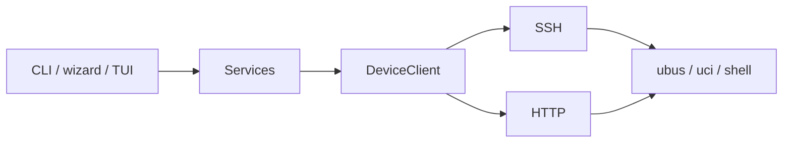

# OpenWrt CLI

**English** | [简体中文](README.zh.md)

[](https://www.python.org/)
[](https://github.com/Necho-dev/openwrt-cli/actions/workflows/unit-test.yml)
[](LICENSE)
[](https://github.com/Necho-dev/openwrt-cli)

Remote OpenWrt admin over **SSH** or **LuCI/ubus HTTP**. The same services power CLI tables (typer + rich), the setup/wizard flows (questionary), and the full-screen TUI (textual).

The command is **`openwrt`**. `openwrt-cli` is still installed as a compatibility alias; docs and `--help` always say `openwrt`.

<p align="center">
  
</p>

<p align="center">
  
</p>

<table>
  <tr>
    <td align="center" valign="top" width="50%">
      <p><strong>Network</strong></p>
      
    </td>
    <td align="center" valign="top" width="50%">
      <p><strong>Neighbors</strong></p>
      
    </td>
  </tr>
</table>

<table>
  <tr>
    <td align="center" valign="top" width="33%">
      <p><strong>Services</strong></p>
      
    </td>
    <td align="center" valign="top" width="33%">
      <p><strong>Process</strong></p>
      
    </td>
    <td align="center" valign="top" width="33%">
      <p><strong>Logs</strong></p>
      
    </td>
  </tr>
</table>

## Features

- **Three surfaces** — CLI tables, `setup` + `wizard`, and `openwrt tui`
- **doctor** — capability-aware SSH/HTTP health checks, structured, `-f json` ready
- **Network** — interfaces, routes, rules, neighbors, DHCP leases with MAC vendors, optional Bandix history
- **One device model** — SSH and HTTP share ubus / uci / shell semantics; missing capability fails loudly (no fake data)
- **Agent-ready** — `-f json` / `-f compact`, no TTY or color required
- **English / 简体中文 UI** — command names stay English

## Quick Start

```bash
curl -fsSL https://raw.githubusercontent.com/Necho-dev/openwrt-cli/main/install.sh | bash
openwrt setup
openwrt doctor
openwrt tui
```

Non-interactive equivalent:

```bash
openwrt -H 192.168.1.1 -u root --password your_password --save-config
```

<p align="center">
  
</p>

## Installation

Requires **Python >= 3.12**.

**Linux / macOS**

```bash
curl -fsSL https://raw.githubusercontent.com/Necho-dev/openwrt-cli/main/install.sh | bash
```

**Windows** — clone, then run `install.bat`, or:

```cmd
pip install git+https://github.com/Necho-dev/openwrt-cli.git
```

**pip / pipx**

```bash
pipx install git+https://github.com/Necho-dev/openwrt-cli.git
```

**Development (Poetry)**

```bash
git clone https://github.com/Necho-dev/openwrt-cli.git
cd openwrt-cli
poetry install
poetry run openwrt --help
```

```bash
poetry install --with dev
poetry run pytest -m "not live"           # no device, CI-safe
OPENWRT_LIVE=1 poetry run pytest -m live  # read-only against ~/.openwrt-cli.yaml
```

Destructive commands (reboot, reload, service restart, …) are not in the live set.

## Command Overview

Flags may sit before or after a subcommand (`openwrt network leases -f json`). Full help: `openwrt --help` and `openwrt <group> --help`.

| Option | Description |
|--------|-------------|
| `-H`, `--host` | Device IP |
| `-u`, `--user` | Username |
| `-p`, `--port` | Port (SSH 22 / HTTP 80 / HTTPS 443) |
| `-i`, `--identity-file` | SSH private key path (same as `ssh -i`) |
| `--password` | Login password |
| `--ssh` | Connect over SSH |
| `--http` | LuCI/ubus HTTP |
| `--https` | LuCI/ubus HTTPS |
| `--config` | Config file path |
| `-L`, `--language` | UI language: `en` / `zh` |
| `-f`, `--format` | Output format: `text` / `json` / `compact` |
| `--json` | Same as `-f json`; Agent-friendly |
| `--yes`, `-y` | Skip confirmation |
| `-v`, `--version` | Show version and exit |

Success and failure are one object with `ok`. Interactive commands (`setup`, `tui`, `wizard`) refuse JSON (`error: interactive`). Destructive actions prompt on a TTY; in a pipe or JSON mode they need `--yes` or they exit `2`.

### doctor / system / logs

```bash
openwrt doctor
openwrt doctor --quick
openwrt -f json doctor
openwrt system status
openwrt system memory
openwrt system processes
openwrt logs system --tail 80
openwrt logs system -f
openwrt logs kernel --tail 80
openwrt logs system --since 10m
```

### network

```bash
openwrt network interfaces
openwrt network interfaces --rates
openwrt network routes
openwrt network rules
openwrt network neighbors          # IPv4 neighbors; Bandix overlays device rates when present
openwrt network leases
openwrt network metrics            # Bandix history (needs luci-app-bandix)
openwrt network metrics --ip 192.168.1.50 --since 30m
openwrt network wifi list
openwrt network lan show
openwrt network reload --yes
```

`qos` is OpenWrt SQM / `tc` (`luci-app-sqm`), not Bandix per-device limits.

### firewall / qos

UCI views work over HTTP. Commands that need iptables or `tc` fail on HTTP instead of inventing data — use `--ssh`.

```bash
openwrt --https firewall zones     # UCI, OK
openwrt --https firewall rules     # needs iptables → fail (use --ssh)
openwrt qos status
```

### service / user / backup

```bash
openwrt service list --running
openwrt service show firewall
openwrt service restart firewall --yes
openwrt user key add --yes
openwrt backup create -o /tmp/bak.tar.gz
openwrt backup restore /tmp/bak.tar.gz --yes
```

### setup / wizard / tui

```bash
openwrt setup
openwrt wizard                 # menu
openwrt wizard wifi            # user | hostname | wifi | lan | service
openwrt tui
```

TUI keys: `1`–`6` tabs, `r` refresh, `f` filter, `q` quit, `?` help.

## Configuration

`openwrt setup` or `--save-config` writes `~/.openwrt-cli.yaml`:

```yaml
host: 192.168.1.1
user: root
port: 22
transport: ssh
# password: prefer an SSH key
identity_file: ~/.ssh/id_ed25519_openwrt
```

```bash
openwrt config show
openwrt config path
openwrt config set -H 192.168.1.1 --ssh
openwrt config set --language en
```

UI language (tables, TUI, setup, help) resolves as:

1. `-L/--language` or `OPENWRT_LANG` (`en` / `zh`)
2. `language` in the config file
3. System locale (`LANG` / `LC_ALL`) — Chinese locales get 简体中文, everything else English

`openwrt setup` detects the system language, asks you to confirm, and writes it to the config file.

## Project Layout

```
src/openwrt_cli/
  app.py          # entry (openwrt / openwrt-cli)
  commands/       # Typer
  services/       # presentation-free business logic
  tui/            # textual dashboard
  ui/             # Rich / questionary
  core/           # DeviceClient, SSH / HTTP channels
  i18n/
```



## FAQ

**SSH will not connect**

```bash
openwrt setup
ssh -v -p 22 root@192.168.1.1
```

**Use a key instead of a password**

```bash
openwrt user key add --yes
openwrt -H 192.168.1.1 -i ~/.ssh/id_ed25519_openwrt --save-config
```

**Web admin only, no SSH**

```bash
openwrt setup          # pick HTTP API
openwrt --https system status
```

**`firewall rules` fails over HTTP** — that path needs iptables. Use `--ssh`, or stick to UCI commands such as `firewall zones`.

**JSON / pipe errors on reboot, reload, restart** — add `--yes`.

**`openwrt` is not on PATH** — a `pip install --user` may have dropped the script in `python -m site --user-base` + `/bin`. Add that directory, or install with `pipx`.

**Switch the UI language**

```bash
openwrt -L zh doctor
openwrt config set --language zh
```

## License

MIT — see [LICENSE](LICENSE).
