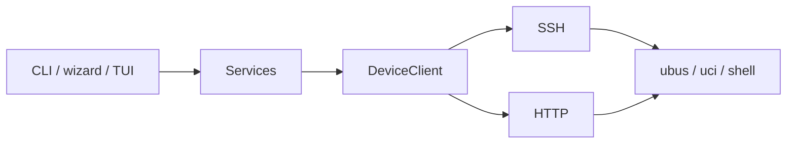

# OpenWrt CLI

**English** | [简体中文](README.zh.md)

[](https://www.python.org/)
[](https://github.com/Necho-dev/openwrt-cli/actions/workflows/unit-test.yml)
[](https://github.com/Necho-dev/openwrt-cli/releases)
[](https://pypi.org/project/openwrt-cli/)
[](LICENSE)
[](https://github.com/Necho-dev/openwrt-cli)

Remote OpenWrt admin over **SSH** or **LuCI/ubus HTTP**. The same services power CLI tables (typer + rich), the setup/wizard flows (questionary), and the full-screen TUI (textual).

The command is **`openwrt`**. `openwrt-cli` is still installed as a compatibility alias; docs and `--help` always say `openwrt`.

<p align="center">
  
</p>

<p align="center">
  
</p>

<table>
  <tr>
    <td align="center" valign="top" width="33%">
      <p><strong>Network</strong></p>
      
    </td>
    <td align="center" valign="top" width="33%">
      <p><strong>Neighbors</strong></p>
      
    </td>
    <td align="center" valign="top" width="33%">
      <p><strong>PassWall2*</strong></p>
      
    </td>
  </tr>
</table>

<table>
  <tr>
    <td align="center" valign="top" width="33%">
      <p><strong>Services</strong></p>
      
    </td>
    <td align="center" valign="top" width="33%">
      <p><strong>Process</strong></p>
      
    </td>
    <td align="center" valign="top" width="33%">
      <p><strong>Logs</strong></p>
      
    </td>
  </tr>
</table>

\* PassWall2 requires **openwrt-cli &gt;= 1.1.0** and `luci-app-passwall2` on the router.

## Features

- **Three surfaces** — CLI tables, `setup` + `wizard`, and `openwrt tui`
- **doctor** — capability-aware SSH/HTTP health checks, structured, `-f json` ready
- **Network** — interfaces, routes, rules, neighbors, DHCP leases with MAC vendors, optional Bandix history
- **PassWall2** — optional `luci-app-passwall2`; **requires openwrt-cli &gt;= 1.1.0**. Read status / nodes / ACL / logs; add, edit, delete nodes and ACL; TUI tab `7` when the package is present
- **One device model** — SSH and HTTP share ubus / uci / shell semantics; missing capability fails loudly (no fake data)
- **Agent-ready** — `-f json` / `-f compact`, no TTY or color required
- **Profiles** — several router logins in one file. `openwrt profiles` manages them; the TUI host label switches the active one
- **MCP / Skills** — wire Cursor / Claude Code / Codex in [Drop it into your AI agent](#drop-it-into-your-ai-agent). A tool can name a profile for that call. Default `mcp.mode` is **readonly**
- **English / 简体中文 UI** — command names stay English

## Quick Start

```bash
curl -fsSL https://raw.githubusercontent.com/Necho-dev/openwrt-cli/main/install.sh | bash
openwrt setup
openwrt doctor
openwrt tui
```

Using this from Cursor, Claude Code, or another Agent? Jump to [Drop it into your AI agent](#drop-it-into-your-ai-agent).

Non-interactive equivalent:

```bash
openwrt -H 192.168.1.1 -u root --password your_password --save-config
```

<p align="center">
  
</p>

## Installation

Requires **Python >= 3.12**.

**Linux / macOS**

```bash
curl -fsSL https://raw.githubusercontent.com/Necho-dev/openwrt-cli/main/install.sh | bash
```

**Windows** — clone, then run `install.bat`, or:

```cmd
pip install "openwrt-cli[mcp] @ git+https://github.com/Necho-dev/openwrt-cli.git"
```

**pip / pipx**

```bash
pipx install "openwrt-cli[mcp] @ git+https://github.com/Necho-dev/openwrt-cli.git"
```

**Development (Poetry)**

```bash
git clone https://github.com/Necho-dev/openwrt-cli.git
cd openwrt-cli
poetry install
poetry run openwrt --help
```

```bash
poetry install --with dev
poetry run pytest -m "not live"           # no device, CI-safe
OPENWRT_LIVE=1 poetry run pytest -m live  # read-only against ~/.openwrt-cli.yaml
```

Destructive commands (reboot, reload, service restart, …) are not in the live set.

**Release** — bump `[project].version` in `pyproject.toml`, add a matching `## [x.y.z]` section to both [CHANGELOG.md](CHANGELOG.md) and [CHANGELOG.zh.md](CHANGELOG.zh.md), then tag `vx.y.z` and push the tag. The publish workflow runs unit tests, checks the tag against `pyproject.toml` and PyPI (refuses a version that already exists), requires the two changelogs to list the same versions, builds the wheel, uploads it, and opens a GitHub Release from the English notes (with a link to the Chinese changelog).

## Command Overview

Flags may sit before or after a subcommand (`openwrt network leases -f json`). Full help: `openwrt --help` and `openwrt <group> --help`.

| Option | Description |
|--------|-------------|
| `-H`, `--host` | Device IP |
| `-u`, `--user` | Username |
| `-p`, `--port` | Port (SSH 22 / HTTP 80 / HTTPS 443) |
| `-i`, `--identity-file` | SSH private key path (same as `ssh -i`) |
| `--password` | Login password |
| `--ssh` | Connect over SSH |
| `--http` | LuCI/ubus HTTP |
| `--https` | LuCI/ubus HTTPS |
| `--config` | Config file path |
| `-L`, `--language` | UI language: `en` / `zh` |
| `-f`, `--format` | Output format: `text` / `json` / `compact` |
| `--json` | Same as `-f json`; Agent-friendly |
| `--yes`, `-y` | Skip confirmation |
| `-v`, `--version` | Show version and exit |

Success and failure are one object with `ok`. Interactive commands (`setup`, `tui`, `wizard`) refuse JSON (`error: interactive`). Destructive actions prompt on a TTY; in a pipe or JSON mode they need `--yes` or they exit `2`.

`-H`, `-u`, `-p`, `--ssh`, `--http`, and `--https` on `profiles` and `config` are fields of the profile being edited. On every other command they override the connection for this process only, and they do not rewrite `~/.openwrt-cli.yaml` unless you also pass `--save-config`.

### doctor / system / logs

```bash
openwrt doctor
openwrt doctor --quick
openwrt -f json doctor
openwrt system status
openwrt system memory
openwrt system processes
openwrt logs system --tail 80
openwrt logs system -f
openwrt logs kernel --tail 80
openwrt logs system --since 10m
```

### network

```bash
openwrt network interfaces
openwrt network interfaces --rates
openwrt network routes
openwrt network rules
openwrt network neighbors          # IPv4 neighbors; Bandix overlays device rates when present
openwrt network set-hostname --mac aa:bb:cc:dd:ee:ff --name phone --yes
openwrt network leases
openwrt network metrics            # Bandix history (needs luci-app-bandix)
openwrt network metrics --ip 192.168.1.50 --since 30m
openwrt network wifi list
openwrt network lan show
openwrt network reload --yes
```

`qos` is OpenWrt SQM / `tc` (`luci-app-sqm`), not Bandix per-device limits.

### passwall2

Requires **openwrt-cli &gt;= 1.1.0** and `luci-app-passwall2` on the router. Older CLI builds do not have this command group or TUI tab.

When the package is present, TUI adds tab `7` with Nodes / Subscribe / Settings / Rules / ACL / Logs. The node list shows type, protocol, address, port, Ping, and TCPing; the right pane is the selected node. Keys: `a` add, `e` edit, `Del` delete, `p` Ping, `c` TCPing, `[` `]` switch sub-pages.

Read: status, nodes (Ping + TCPing on list enter/refresh), subscribe, settings, components, ACL, and logs. Write nodes and ACL through UCI (`node add/set/delete`, `acl add/set/delete`, `acl source add/remove`); `--apply` restarts PassWall2. No subscribe refresh, clear_log, or component update.

```bash
openwrt passwall2 status
openwrt passwall2 nodes
openwrt passwall2 node show <id>
openwrt passwall2 node add --from-url 'vless://...' --apply --yes
openwrt passwall2 node set <id> --remarks HK --yes
openwrt passwall2 acl
openwrt passwall2 acl add --remarks iot --sources 192.168.9.10 --yes
openwrt passwall2 logs --tail 80
```

### firewall / qos

UCI views work over HTTP. Commands that need iptables or `tc` fail on HTTP instead of inventing data — use `--ssh`.

```bash
openwrt --https firewall zones     # UCI, OK
openwrt --https firewall rules     # needs iptables → fail (use --ssh)
openwrt qos status
```

### service / user / backup

```bash
openwrt service list --running
openwrt service show firewall
openwrt service restart firewall --yes
openwrt user key add --yes
openwrt backup create -o /tmp/bak.tar.gz
openwrt backup restore /tmp/bak.tar.gz --yes
```

### profiles / config

Saved router logins live under `openwrt profiles`. `openwrt config` is the rest of the file: UI language, the global MCP permission, and which profile is active. It does not print the host or the password. `openwrt user` is the router system user, not this list.

```bash
openwrt profiles list                  # active row marked with ●
openwrt profiles show                  # active profile; password masked
openwrt profiles show lab
openwrt profiles add shop-rpa          # terminal: host and login
openwrt profiles add home -H 192.168.1.1 -u root --ssh
openwrt profiles use lab               # switch the active profile
openwrt profiles use                   # arrow keys, then Enter
openwrt profiles update home           # edit each field; Enter keeps the current value
openwrt profiles update lab --mcp-mode readwrite
openwrt profiles update lab --mcp-mode inherit
openwrt profiles del lab
openwrt config show
openwrt config path
openwrt config set --language en
openwrt config set --mcp-mode readonly # global default for profiles that do not set their own
```

Every `profiles` subcommand accepts `--json`. Omit the name on `show` to print the active profile. On a terminal, `add`, `update`, and `use` ask for anything you left out. Deleting the last profile is allowed; language and the global MCP permission stay. File layout and the upgrade from an older single-host file are in [Configuration](#configuration).

### mcp / skill

These commands do not connect to the router. `mcp` prints client snippets and the permission table. `skill` installs the `openwrt-ops` playbook.

```bash
openwrt mcp privilege                  # each tool vs readonly / readwrite
openwrt mcp json
openwrt mcp json --client cursor
openwrt mcp prompt
openwrt mcp path
openwrt skill detect
openwrt skill install
openwrt skill show
```

An MCP router tool can take `profile` for that call only. Omit it to use the active profile. See [Drop it into your AI agent](#drop-it-into-your-ai-agent).

### setup / wizard / tui

```bash
openwrt setup
openwrt wizard                 # menu
openwrt wizard wifi            # user | hostname | wifi | lan | service
openwrt tui
```

TUI keys: `1`–`6` tabs (`7` PassWall2 when `luci-app-passwall2` is present; **openwrt-cli &gt;= 1.1.0**), `r` refresh, `e` edit (Neighbors hostname / PassWall2 node or ACL), `u` switch profile (or click the host in the bottom-right corner), `f` filter, `q` quit, `?` help.

## Configuration

`openwrt setup` or `--save-config` writes `~/.openwrt-cli.yaml`. The file holds every saved router as a named profile, plus one `active` name. CLI commands, the TUI, and MCP all start from that name. Host, user, port, transport, password, and key belong to the profile. `language` and `mcp.mode` stay global. A profile may set its own `mcp.mode`; when it does not, it inherits the global default.

The first `openwrt setup` asks for a profile name (Enter keeps `home`), then the host and login. A later setup updates the profile you name and leaves the others in place. `-H`, `-u`, and `-p` on an ordinary command override the connection for that process only and do not rewrite the file unless you also pass `--save-config`. `--save-config` updates the active profile; it does not create one.

An older file with the host at the top level loads as a profile named `default`. Reading it does not rewrite the file. The next save writes the shape below and keeps the language and the global MCP permission.

```yaml
language: en
mcp:
  mode: readonly          # global default
active: home
profiles:
  - name: home
    host: 192.168.1.1
    user: root
    port: 22
    transport: ssh
    identity_file: ~/.ssh/id_ed25519_openwrt
  - name: lab
    host: 10.0.0.1
    user: root
    transport: http
    scheme: https
    port: 443
    verify_ssl: false
    mcp:
      mode: readwrite     # this profile only
```

```bash
openwrt config show          # language, global mcp.mode, active name, effective mode
openwrt config path
openwrt config set --language en
openwrt config set --mcp-mode readonly     # global default
openwrt config set --mcp-mode readwrite    # MCP write tools (user must confirm)
openwrt profiles list
openwrt profiles show                  # active profile; password masked
openwrt profiles show lab
openwrt profiles add shop-rpa          # host and login, step by step
openwrt profiles add home -H 192.168.1.1 -u root --ssh -i ~/.ssh/id_ed25519_openwrt
openwrt profiles add lab -H 10.0.0.1 --https --mcp-mode readwrite
openwrt profiles use lab
openwrt profiles use                 # arrow keys, then Enter
openwrt profiles update                 # arrow keys, then edit each field
openwrt profiles update home            # edit each field; Enter keeps the current value
openwrt profiles update home --name house
openwrt profiles update lab --mcp-mode inherit   # follow the global default again
openwrt profiles del lab
```

`profiles add` requires a name you choose. `-u` is the login user on that router, not the profile name. `openwrt user` is still the router system user. `profiles show` and `profiles list --json` mask the password. `profiles del` may remove the last profile; language and the global MCP permission stay, and the next connection needs a new profile. In the TUI, `u` or a click on the bottom-right host switches the active profile after the new connection succeeds.

## Drop it into your AI agent

The CLI is for you. The **skill** (`openwrt-ops`) is the playbook; **MCP** (`openwrt-mcp`) is the tool server. Together they let an Agent run doctor, inspect the LAN / PassWall2, and (only after you allow it) apply a change — without pasting passwords into chat.

Two ways in:

1. **You wire it** (below). Then ask in plain language: *is the router OK? who is on the LAN? PassWall2 status?*
2. **Copy for agent** — paste the block at the end of this section into Cursor / Claude Code / Codex and let it walk the same steps.

### 1. Connect the router once

```bash
openwrt setup
openwrt doctor
```

This writes `~/.openwrt-cli.yaml`. The MCP server reads that file. **Never copy `password` or `identity_file` into MCP JSON.**

### 2. Install the skill

```bash
openwrt skill install            # interactive: pick a detected client
openwrt skill install --yes      # all detected clients, user-level
```

That copies `openwrt-ops` into the Agent skill directory (Cursor `~/.cursor/skills`, Claude Code `~/.claude/skills`, …). `install.sh` / `install.bat` can run this step for you.

### 3. Merge MCP (keep other servers)

```bash
pip install 'openwrt-cli[mcp]'   # skip if install.sh already did this
openwrt mcp privilege            # tools allowed under the current MCP permission
openwrt mcp json                 # generic mcpServers.openwrt
openwrt mcp json --client cursor
openwrt mcp path                 # recommended file per client
```

**Cursor** (`~/.cursor/mcp.json`) · **Trae / Windsurf / Qoder** (same JSON shape):

```json
{
  "mcpServers": {
    "openwrt": {
      "command": "openwrt-mcp"
    }
  }
}
```

**Claude Code**

```bash
claude mcp add openwrt -- openwrt-mcp
```

**Codex** — `openwrt mcp json --client codex` prints TOML for `~/.codex/config.toml`.

Reload MCP in the client. The server key must stay `openwrt`. If `openwrt-mcp` is not on `PATH`, use `python -m openwrt_cli.mcp` instead (`openwrt mcp json` already picks the right launch).

### What the agent can do

| | Tools |
|---|---|
| **First hop** | `profiles_current` · `profiles_list` · `doctor` · `config_show` (no passwords) |
| **Read** | `system_status` · `network_overview` · `network_neighbors` · `network_leases` · `firewall_view` · `service_list` · `passwall2_status` · `passwall2_nodes` (no Ping) · `passwall2_logs` · `logs_read` |
| **Write** | only when `mcp.mode=readwrite` **and** you confirm in chat (`wifi_set`, `lan_set`, PassWall2 node/ACL, `service_action`, …) |
| **Never MCP** | reboot · shutdown · backup restore · user add / passwd / delete — human CLI only (`openwrt system reboot --yes`) |

### Which router the agent talks to

`profiles_current` is the active profile. `profiles_list` lists every saved name, target, and effective permission. Neither tool dials the router, and neither returns a password or a key path.

Router tools take an optional `profile`. Omit it to use the active profile. Pass a name to use that profile for this call only. The result includes `profile`, so two routers in one turn stay distinct. This does not change the profile selected in the CLI or TUI. Do not have the agent run `openwrt profiles use` to retarget later calls.

Different profiles can be queried at the same time. A write is allowed only when **that** profile's effective mode is `readwrite`.

Default `mcp.mode` is **readonly**. Writes return `mcp_readonly` until the user changes it:

```bash
openwrt config set --mcp-mode readwrite          # global default
openwrt profiles update lab --mcp-mode readwrite # this profile only
```

When MCP is connected, **do not** mutate the router with `openwrt … --yes` — that skips `mcp.mode`. `openwrt mcp privilege` shows the same allow / deny table the server uses.

### Copy for agent

Paste this into Cursor, Claude Code, Codex, or any Agent and ask it to finish setup:

```
You're setting up openwrt-cli so I can operate an OpenWrt router from this chat.

WHAT IT IS
  Command: openwrt. Humans use CLI/TUI. You use MCP tools (openwrt-mcp) plus the
  openwrt-ops skill. Transport is SSH or LuCI/ubus HTTP.
  Config lives in ~/.openwrt-cli.yaml — the MCP server reads it. Never copy
  password or identity_file into MCP JSON, chat, or tool output.

INSTALL
  pip install 'openwrt-cli[mcp]'          # or: the repo install.sh / install.bat
  openwrt setup                           # language + host + SSH/HTTP
  openwrt doctor                          # first hop
  openwrt skill install                   # copies openwrt-ops into this Agent
  openwrt mcp json                        # MERGE mcpServers.openwrt; keep other servers

CONNECT MCP
  Cursor:      ~/.cursor/mcp.json  →  { "mcpServers": { "openwrt": { "command": "openwrt-mcp" } } }
  Claude Code: claude mcp add openwrt -- openwrt-mcp
  Codex:       openwrt mcp json --client codex   (TOML → ~/.codex/config.toml)
  If openwrt-mcp is missing: python -m openwrt_cli.mcp
  Reload MCP after saving.

GOLDEN PATH
  profiles_current → doctor on that router
        → read-only inspect (system / network / passwall2)
        → another saved router: pass profile=<name> on that call only
        → writes need that profile's mcp.mode=readwrite
           (user: openwrt profiles update NAME --mcp-mode readwrite)
        → call a write tool only after a clear yes in chat
        → apply / restart is a second write (confirm again)

RULES
  1) Prefer MCP tools when the openwrt server is connected.
     Read-only CLI fallback: openwrt -f json doctor|system status|network leases
  2) Omit profile to use the active profile. Do not run openwrt profiles use
     to retarget later MCP calls. profiles_list / profiles_current omit passwords.
  3) mcp.mode defaults to readonly. Writes return mcp_readonly until readwrite
     on the profile that call names. config set --mcp-mode changes the global default.
  4) When MCP is available, do not mutate with openwrt … --yes (bypasses the guard).
  5) Never invent reboot, shutdown, backup restore, or user add/passwd/delete as MCP tools.

Now: run doctor, then a read-only look at neighbors and PassWall2 status.
Full skill: packaged as openwrt-ops (openwrt skill show).
```

`openwrt mcp prompt` prints a client-specific variant of the same instructions.

UI language (tables, TUI, setup, help) resolves as:

1. `-L/--language` or `OPENWRT_LANG` (`en` / `zh`)
2. `language` in the config file
3. System locale (`LANG` / `LC_ALL`) — Chinese locales get 简体中文, everything else English

`openwrt setup` detects the system language, asks you to confirm, and writes it to the config file. To add another language, see [Contributing a language](#contributing-a-language).

## Project Layout

```
src/openwrt_cli/
  app.py          # entry (openwrt / openwrt-cli)
  commands/       # Typer
  services/       # presentation-free business logic
  mcp/            # Skill pack, MCP guide, FastMCP server
  tui/            # textual dashboard
  ui/             # Rich / questionary
  core/           # DeviceClient, SSH / HTTP channels
  i18n/
```


```mermaid
flowchart LR
  CLI[CLI / wizard / TUI] --> Services
  Services --> DeviceClient
  DeviceClient --> SSH
  DeviceClient --> HTTP
  SSH --> Channels[ubus / uci / shell]
  HTTP --> Channels
```

## Contributing a language

UI strings live in `src/openwrt_cli/i18n/locales/`. One JSON file is one language. The file name, without `.json`, is the language code. `locales/*.json` is already packaged, and the loader picks up every file that does not start with `_`. No Python registration is required.

Command names stay English. Translate the values only. MCP tool descriptions and the `openwrt-ops` skill are English and are not in these files.

Russian (`ru`) is the example below. The same steps apply to any other language.

1. Copy `en.json` to `src/openwrt_cli/i18n/locales/ru.json`. Use the ISO 639-1 primary code in lowercase. Name the file `ru.json`, not `ru_RU.json`. `LANG=ru_RU.UTF-8` is normalized to `ru`. Chinese is the only alias that is special-cased (`zh_CN`, `zh-Hans`, and `cn` all select `zh`).
2. Translate the values. Keep every key, and keep placeholders such as `{name}`, `{error}`, and `{langs}`. A key that starts with `_` is ignored, so it does not count as a translation.
3. Add the native name to **every** catalog, including `en.json`, `zh.json`, and `ru.json`:

```json
"setup.lang.ru": "Русский"
```

`openwrt setup` lists the languages it finds and shows this label. Help text that contains `{langs}` lists the codes on its own.

4. Run `pytest tests/test_i18n.py`. Each catalog must have the same set of keys as `en.json`. A missing or extra key fails the test. At runtime a missing string would fall back to English, but the test does not allow a partial file.
5. Try it:

```bash
openwrt -L ru doctor
OPENWRT_LANG=ru openwrt config show
```

Then update the `en` / `zh` lists in this README so the new code is documented.

`tests/test_i18n.py` treats `de_DE` as an unsupported locale. Adding `ru` does not affect that assertion. Adding `de` does: change the assertion in the same pull request.

## FAQ

**Q:** SSH will not connect. What should I check?

**A:** Run setup again, then compare it with OpenSSH:

```bash
openwrt setup
ssh -v -p 22 root@192.168.1.1
```

**Q:** How do I use a key instead of a password?

**A:** Install the public key on the router, then save the private-key path into the active profile:

```bash
openwrt user key add --yes
openwrt -H 192.168.1.1 -i ~/.ssh/id_ed25519_openwrt --save-config
```

**Q:** The router has a web admin and no SSH. How do I connect?

**A:** Choose the HTTP API in setup, then call commands over HTTPS:

```bash
openwrt setup          # pick HTTP API
openwrt --https system status
```

**Q:** Why does `firewall rules` fail over HTTP?

**A:** That path needs iptables. Use `--ssh`, or stay with UCI commands such as `firewall zones`.

**Q:** Why do reboot, reload, and restart fail in JSON or a pipe?

**A:** Those actions ask for confirmation on a terminal. Add `--yes` when there is no terminal.

**Q:** Why is `passwall2` unknown, or why is TUI tab 7 missing?

**A:** That feature shipped in **openwrt-cli &gt;= 1.1.0**. Upgrade the CLI, and install `luci-app-passwall2` on the router. `openwrt -v` prints the package version.

**Q:** Why is `openwrt` not on PATH?

**A:** A `pip install --user` may have placed the script in `python -m site --user-base` + `/bin`. Add that directory, or install with `pipx`.

**Q:** How do I use more than one router?

**A:** `openwrt profiles use`, or `u` in the TUI, changes the active profile for the CLI, the TUI, and the default MCP target. An MCP tool can still pass `profile` for one call without changing that selection.

**Q:** How do I switch the UI language?

**A:** `-L` applies to one command. `config set` saves the choice:

```bash
openwrt -L zh doctor
openwrt config set --language zh
```

## Acknowledgments

This project talks to OpenWrt through the official stack:

- [openwrt/openwrt](https://github.com/openwrt/openwrt) — the OpenWrt operating system
- [openwrt/luci](https://github.com/openwrt/luci) — LuCI web interface and ubus/HTTP API
- [openwrt/uci](https://github.com/openwrt/uci) — Unified Configuration Interface

Thanks to [a6726170/openwrt-cli](https://github.com/a6726170/openwrt-cli) for the original inspiration.

## License

MIT — see [LICENSE](LICENSE).
