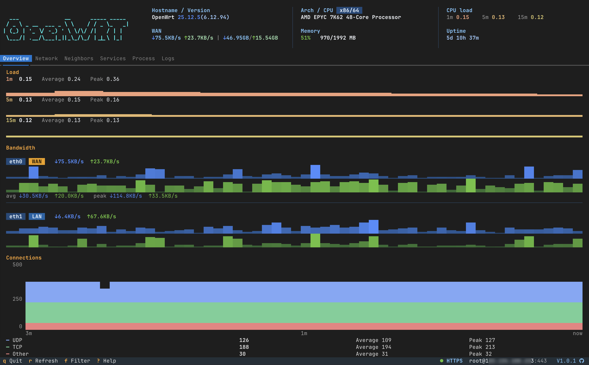
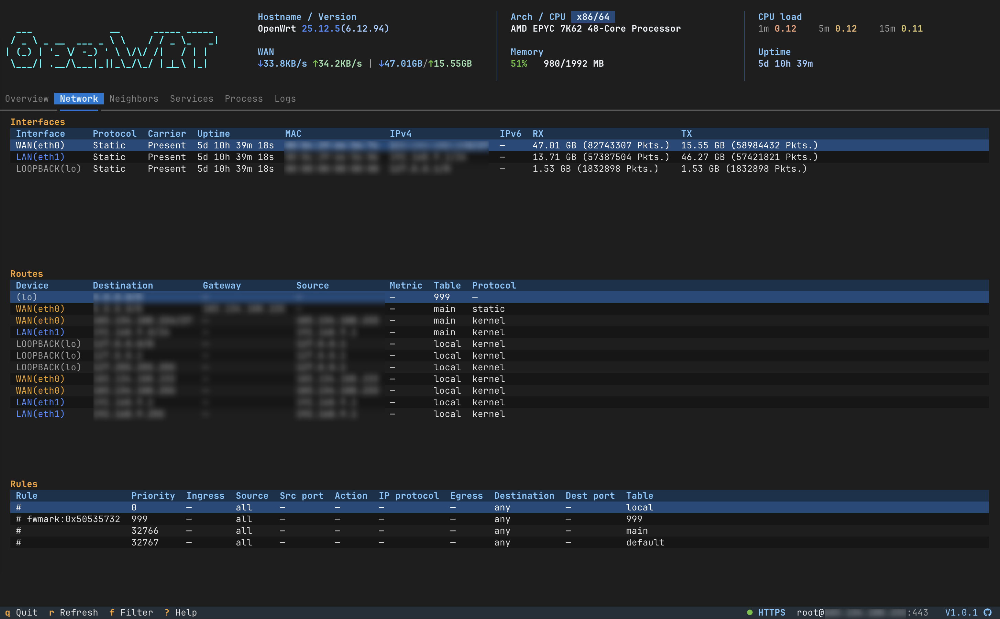
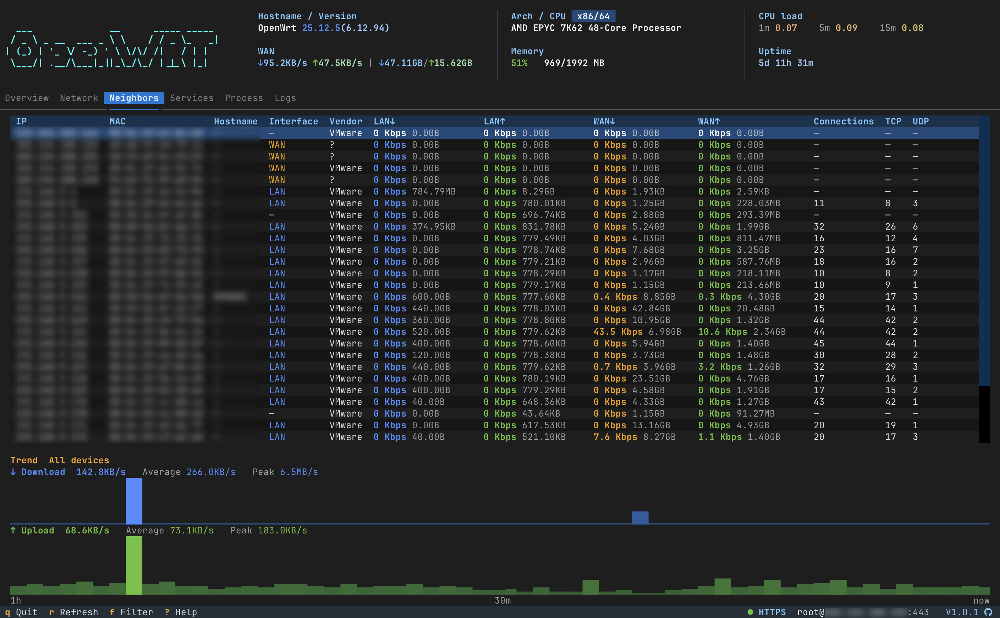
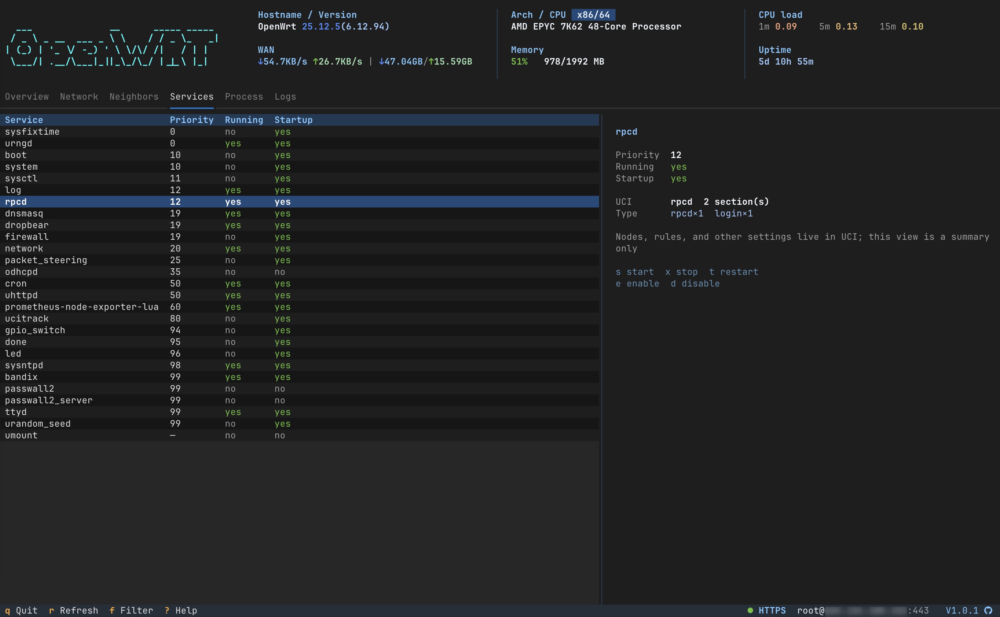
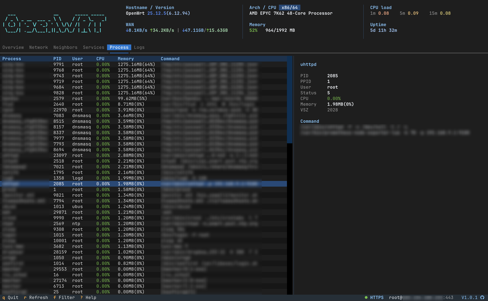
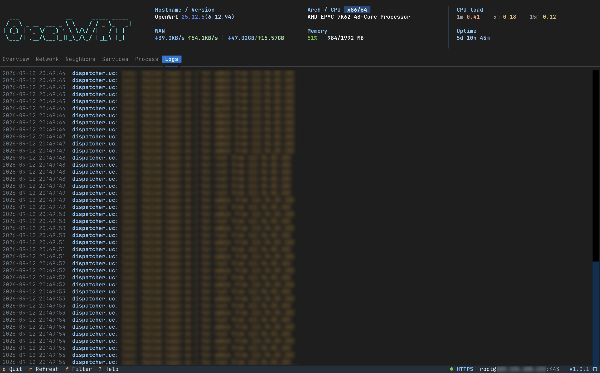
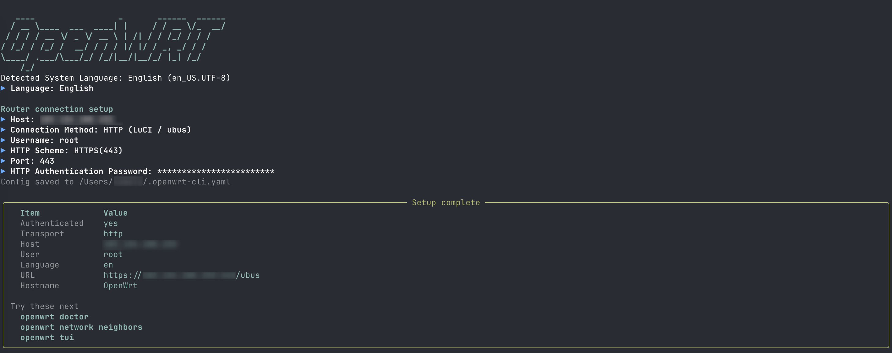
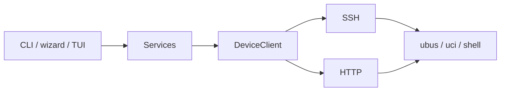

# OpenWrt CLI

[English](README.md) | **简体中文**

[](https://www.python.org/)
[](https://github.com/Necho-dev/openwrt-cli/actions/workflows/unit-test.yml)
[](LICENSE)
[](https://github.com/Necho-dev/openwrt-cli)

通过 **SSH** 或 **LuCI/ubus HTTP** 远程管理 OpenWrt。同一套 Service 同时支撑 CLI 表格（typer + rich）、setup/wizard 向导（questionary）和全屏 TUI（textual）。

主命令是 **`openwrt`**。`openwrt-cli` 仍会作为兼容别名安装；文档与 `--help` 一律写 `openwrt`。

<p align="center">
  
</p>

<p align="center">
  
</p>

<table>
  <tr>
    <td align="center" valign="top" width="50%">
      <p><strong>网络</strong></p>
      
    </td>
    <td align="center" valign="top" width="50%">
      <p><strong>邻居</strong></p>
      
    </td>
  </tr>
</table>

<table>
  <tr>
    <td align="center" valign="top" width="33%">
      <p><strong>服务</strong></p>
      
    </td>
    <td align="center" valign="top" width="33%">
      <p><strong>进程</strong></p>
      
    </td>
    <td align="center" valign="top" width="33%">
      <p><strong>日志</strong></p>
      
    </td>
  </tr>
</table>

## 核心功能

- **三层交互** — CLI 表格、`setup` + `wizard`、以及 `openwrt tui`
- **doctor** — 按 SSH/HTTP 能力做体检，结果结构化，可直接 `-f json`
- **网络** — 接口、路由、规则、邻居、带 MAC 厂商的 DHCP 租约，可选 Bandix 历史速率
- **同一套设备模型** — SSH 与 HTTP 共用 ubus / uci / shell 语义；缺能力就明确失败（不造假数据）
- **Agent-ready** — `-f json` / `-f compact`，不依赖 TTY 或颜色
- **中英界面** — 命令名始终是英文

## 快速开始

```bash
curl -fsSL https://raw.githubusercontent.com/Necho-dev/openwrt-cli/main/install.sh | bash
openwrt setup
openwrt doctor
openwrt tui
```

非交互等价写法：

```bash
openwrt -H 192.168.1.1 -u root --password your_password --save-config
```

<p align="center">
  
</p>

## 安装

需要 **Python >= 3.12**。

**Linux / macOS**

```bash
curl -fsSL https://raw.githubusercontent.com/Necho-dev/openwrt-cli/main/install.sh | bash
```

**Windows** — clone 后运行 `install.bat`，或：

```cmd
pip install git+https://github.com/Necho-dev/openwrt-cli.git
```

**pip / pipx**

```bash
pipx install git+https://github.com/Necho-dev/openwrt-cli.git
```

**开发安装（Poetry）**

```bash
git clone https://github.com/Necho-dev/openwrt-cli.git
cd openwrt-cli
poetry install
poetry run openwrt --help
```

```bash
poetry install --with dev
poetry run pytest -m "not live"           # 无设备，可进 CI
OPENWRT_LIVE=1 poetry run pytest -m live  # 只读实机，读 ~/.openwrt-cli.yaml
```

破坏性命令（reboot、reload、service restart 等）不在实机集里。

## Command 概览

全局选项可以写在子命令前或后（`openwrt network leases -f json`）。完整帮助见 `openwrt --help` 和 `openwrt <group> --help`。

| 选项 | 说明 |
|------|------|
| `-H`, `--host` | 设备 IP |
| `-u`, `--user` | 用户名 |
| `-p`, `--port` | 端口（SSH 22 / HTTP 80 / HTTPS 443） |
| `-i`, `--identity-file` | SSH 私钥路径（等同 `ssh -i`） |
| `--password` | 登录密码 |
| `--ssh` | SSH 连接 |
| `--http` | LuCI/ubus HTTP |
| `--https` | LuCI/ubus HTTPS |
| `--config` | 配置文件路径 |
| `-L`, `--language` | 界面语言：`en` / `zh` |
| `-f`, `--format` | 输出格式：`text` / `json` / `compact` |
| `--json` | 等同 `-f json`，供 Agent 使用 |
| `--yes`, `-y` | 跳过确认 |
| `-v`, `--version` | 显示版本后退出 |

成功和失败都是带 `ok` 的同一个对象。交互命令（`setup`、`tui`、`wizard`）拒绝 JSON（`error: interactive`）。破坏性操作在 TTY 会提问；管道或 JSON 模式下必须加 `--yes`，否则退出码 `2`。

### doctor / system / logs

```bash
openwrt doctor
openwrt doctor --quick
openwrt -f json doctor
openwrt system status
openwrt system memory
openwrt system processes
openwrt logs system --tail 80
openwrt logs system -f
openwrt logs kernel --tail 80
openwrt logs system --since 10m
```

### network

```bash
openwrt network interfaces
openwrt network interfaces --rates
openwrt network routes
openwrt network rules
openwrt network neighbors          # IPv4 邻居；有 Bandix 时叠加设备速率
openwrt network leases
openwrt network metrics            # Bandix 历史（需要 luci-app-bandix）
openwrt network metrics --ip 192.168.1.50 --since 30m
openwrt network wifi list
openwrt network lan show
openwrt network reload --yes
```

`qos` 读的是 OpenWrt SQM / `tc`（`luci-app-sqm`），不是 Bandix 每设备限速。

### firewall / qos

UCI 视图可以走 HTTP。依赖 iptables 或 `tc` 的命令在 HTTP 下会明确失败，而不是返回假数据 — 请改用 `--ssh`。

```bash
openwrt --https firewall zones     # UCI，可用
openwrt --https firewall rules     # 需要 iptables → 失败（改 --ssh）
openwrt qos status
```

### service / user / backup

```bash
openwrt service list --running
openwrt service show firewall
openwrt service restart firewall --yes
openwrt user key add --yes
openwrt backup create -o /tmp/bak.tar.gz
openwrt backup restore /tmp/bak.tar.gz --yes
```

### setup / wizard / tui

```bash
openwrt setup
openwrt wizard                 # 菜单
openwrt wizard wifi            # user | hostname | wifi | lan | service
openwrt tui
```

TUI 快捷键：`1`–`6` 切页，`r` 刷新，`f` 过滤，`q` 退出，`?` 帮助。

## 配置

`openwrt setup` 或 `--save-config` 会写入 `~/.openwrt-cli.yaml`：

```yaml
host: 192.168.1.1
user: root
port: 22
transport: ssh
# password: 建议使用 SSH 密钥
identity_file: ~/.ssh/id_ed25519_openwrt
```

```bash
openwrt config show
openwrt config path
openwrt config set -H 192.168.1.1 --ssh
openwrt config set --language zh
```

界面语言（表头、TUI、setup、帮助）按下面顺序解析：

1. `-L/--language` 或 `OPENWRT_LANG`（`en` / `zh`）
2. 配置文件里的 `language`
3. 系统 locale（`LANG` / `LC_ALL`）— 中文环境用简体中文，其余默认英文

`openwrt setup` 会检测系统语言并让你确认，然后写入配置文件。

## 目录结构

```
src/openwrt_cli/
  app.py          # 入口（openwrt / openwrt-cli）
  commands/       # Typer
  services/       # 与呈现无关的业务
  tui/            # textual 仪表盘
  ui/             # Rich / questionary
  core/           # DeviceClient、SSH / HTTP 通道
  i18n/
```



## 常见问题

**SSH 连不上**

```bash
openwrt setup
ssh -v -p 22 root@192.168.1.1
```

**想用密钥而不是密码**

```bash
openwrt user key add --yes
openwrt -H 192.168.1.1 -i ~/.ssh/id_ed25519_openwrt --save-config
```

**只有 Web 管理、没有 SSH**

```bash
openwrt setup          # 选 HTTP API
openwrt --https system status
```

**HTTP 下 `firewall rules` 失败** — 这条路径需要 iptables。改用 `--ssh`，或只用 `firewall zones` 这类 UCI 命令。

**JSON / 管道里执行 reboot、reload、restart 报错** — 加上 `--yes`。

**PATH 里找不到 `openwrt`** — `pip install --user` 可能把脚本装到 `python -m site --user-base` + `/bin`。把该目录加入 PATH，或改用 `pipx`。

**切换界面语言**

```bash
openwrt -L zh doctor
openwrt config set --language zh
```

## 许可证

MIT — 见 [LICENSE](LICENSE)。
