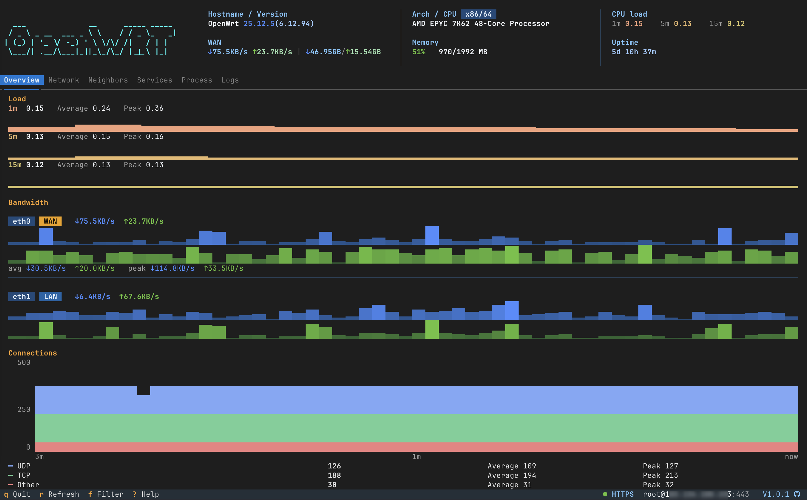
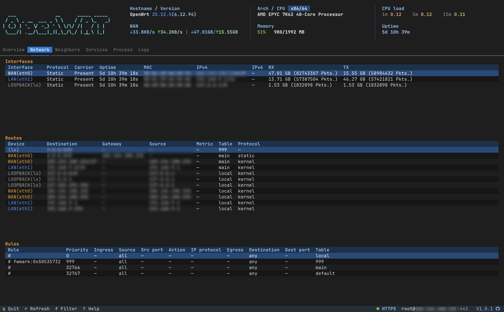
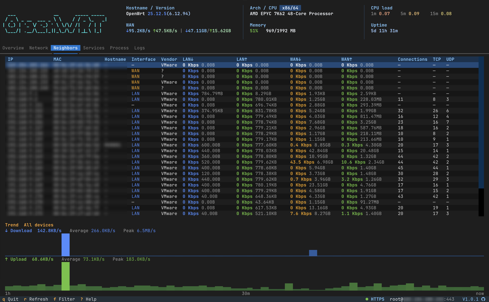
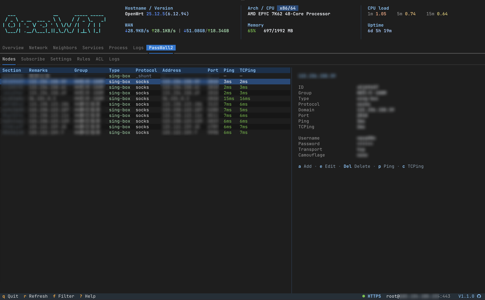
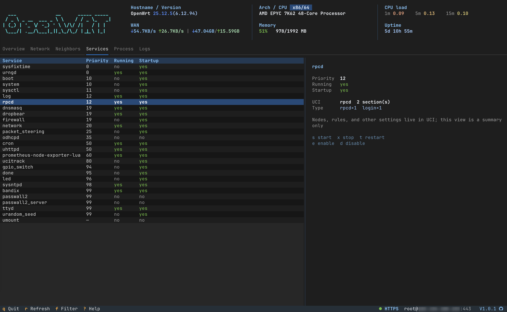
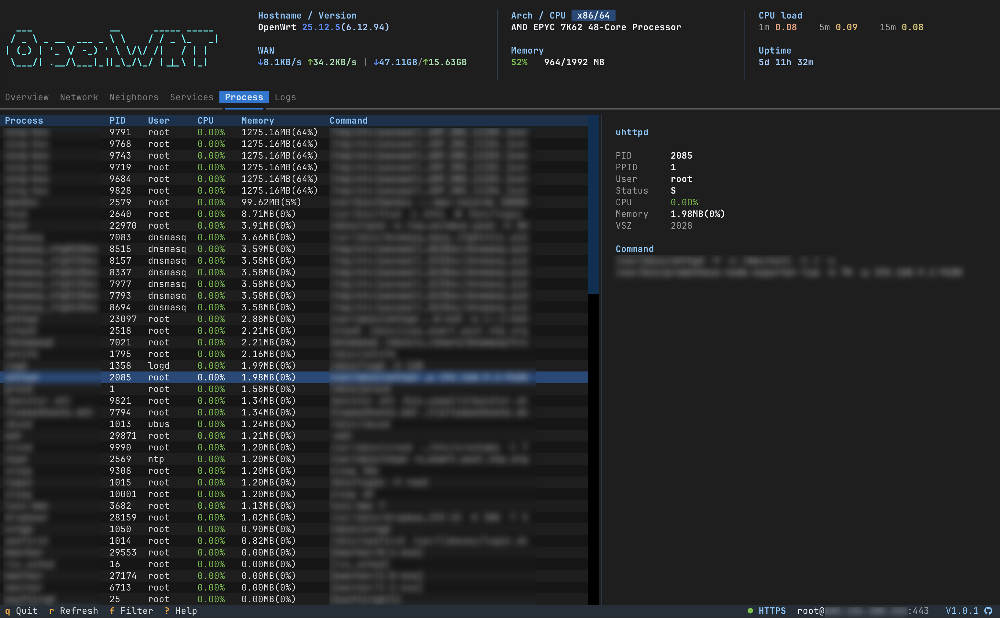
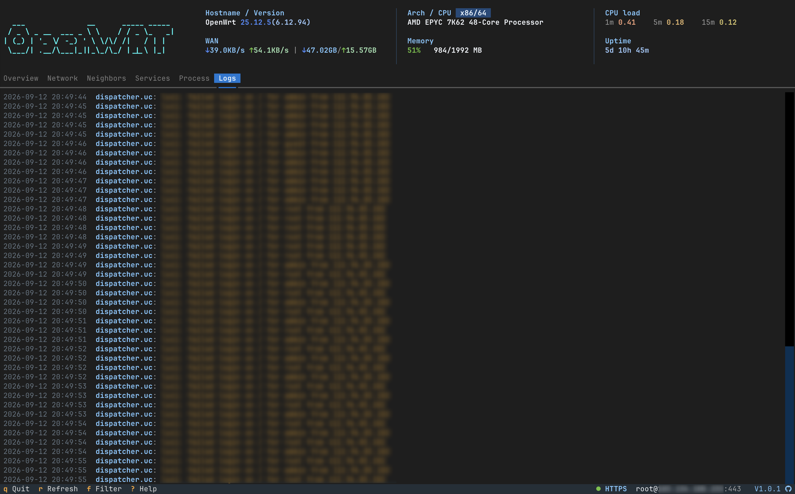
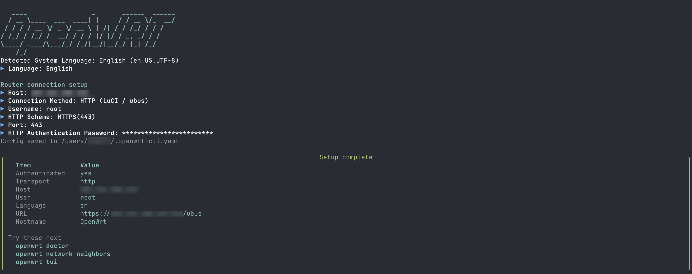
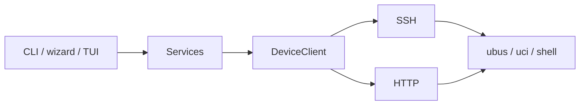

# OpenWrt CLI

[English](README.md) | **简体中文**

[](https://www.python.org/)
[](https://github.com/Necho-dev/openwrt-cli/actions/workflows/unit-test.yml)
[](https://github.com/Necho-dev/openwrt-cli/releases)
[](https://pypi.org/project/openwrt-cli/)
[](LICENSE)
[](https://github.com/Necho-dev/openwrt-cli)

通过 **SSH** 或 **LuCI/ubus HTTP** 远程管理 OpenWrt。同一套 Service 同时支撑 CLI 表格（typer + rich）、setup/wizard 向导（questionary）和全屏 TUI（textual）。

主命令是 **`openwrt`**。`openwrt-cli` 仍会作为兼容别名安装；文档与 `--help` 一律写 `openwrt`。

<p align="center">
  
</p>

<p align="center">
  
</p>

<table>
  <tr>
    <td align="center" valign="top" width="33%">
      <p><strong>网络</strong></p>
      
    </td>
    <td align="center" valign="top" width="33%">
      <p><strong>邻居</strong></p>
      
    </td>
    <td align="center" valign="top" width="33%">
      <p><strong>PassWall2*</strong></p>
      
    </td>
  </tr>
</table>

<table>
  <tr>
    <td align="center" valign="top" width="33%">
      <p><strong>服务</strong></p>
      
    </td>
    <td align="center" valign="top" width="33%">
      <p><strong>进程</strong></p>
      
    </td>
    <td align="center" valign="top" width="33%">
      <p><strong>日志</strong></p>
      
    </td>
  </tr>
</table>

\* PassWall2 需要 **openwrt-cli &gt;= 1.1.0**，路由器上还需 `luci-app-passwall2`。

## 核心功能

- **三层交互** — CLI 表格、`setup` + `wizard`、以及 `openwrt tui`
- **doctor** — 按 SSH/HTTP 能力做体检，结果结构化，可直接 `-f json`
- **网络** — 接口、路由、规则、邻居、带 MAC 厂商的 DHCP 租约，可选 Bandix 历史速率
- **PassWall2** — 可选 `luci-app-passwall2`；**需要 openwrt-cli &gt;= 1.1.0**。读状态 / 节点 / ACL / 日志；可增删改节点与 ACL；探测到插件时出现 TUI 第 `7` 页
- **同一套设备模型** — SSH 与 HTTP 共用 ubus / uci / shell 语义；缺能力就明确失败（不造假数据）
- **Agent-ready** — `-f json` / `-f compact`，不依赖 TTY 或颜色
- **多配置档** — 一份配置文件保存多台路由器。`openwrt profiles` 管理它们；TUI 右下角的主机名切换当前档
- **MCP / Skills** — 见 [给 Agent 使用](#给-agent-使用)，可接到 Cursor、Claude Code、Codex。工具可用 `profile` 指定本次查询的配置档。默认 `mcp.mode` 为 **readonly**
- **中英界面** — 命令名始终是英文

## 快速开始

```bash
curl -fsSL https://raw.githubusercontent.com/Necho-dev/openwrt-cli/main/install.sh | bash
openwrt setup
openwrt doctor
openwrt tui
```

想在 Cursor、Claude Code 里让助手查路由器、改配置？见 [给 Agent 使用](#给-agent-使用)。

非交互等价写法：

```bash
openwrt -H 192.168.1.1 -u root --password your_password --save-config
```

<p align="center">
  
</p>

## 安装

需要 **Python >= 3.12**。

**Linux / macOS**

```bash
curl -fsSL https://raw.githubusercontent.com/Necho-dev/openwrt-cli/main/install.sh | bash
```

**Windows** — clone 后运行 `install.bat`，或：

```cmd
pip install "openwrt-cli[mcp] @ git+https://github.com/Necho-dev/openwrt-cli.git"
```

**pip / pipx**

```bash
pipx install "openwrt-cli[mcp] @ git+https://github.com/Necho-dev/openwrt-cli.git"
```

**开发安装（Poetry）**

```bash
git clone https://github.com/Necho-dev/openwrt-cli.git
cd openwrt-cli
poetry install
poetry run openwrt --help
```

```bash
poetry install --with dev
poetry run pytest -m "not live"           # 无设备，可进 CI
OPENWRT_LIVE=1 poetry run pytest -m live  # 只读实机，读 ~/.openwrt-cli.yaml
```

破坏性命令（reboot、reload、service restart 等）不在实机集里。

**发布** — 先改 `pyproject.toml` 的 `[project].version`，在 [CHANGELOG.md](CHANGELOG.md) 和 [CHANGELOG.zh.md](CHANGELOG.zh.md) 写好同一节 `## [x.y.z]`，再打 `vx.y.z` 并推送 tag。发布工作流会先跑单测，再核对 tag 与 `pyproject.toml`、确认 PyPI 上没有该版本、并要求中英文 Changelog 版本号对齐，然后打包上传；GitHub Release 用英文说明，并附上中文 Changelog 链接。

## Command 概览

全局选项可以写在子命令前或后（`openwrt network leases -f json`）。完整帮助见 `openwrt --help` 和 `openwrt <group> --help`。

| 选项 | 说明 |
|------|------|
| `-H`, `--host` | 设备 IP |
| `-u`, `--user` | 用户名 |
| `-p`, `--port` | 端口（SSH 22 / HTTP 80 / HTTPS 443） |
| `-i`, `--identity-file` | SSH 私钥路径（等同 `ssh -i`） |
| `--password` | 登录密码 |
| `--ssh` | SSH 连接 |
| `--http` | LuCI/ubus HTTP |
| `--https` | LuCI/ubus HTTPS |
| `--config` | 配置文件路径 |
| `-L`, `--language` | 界面语言：`en` / `zh` |
| `-f`, `--format` | 输出格式：`text` / `json` / `compact` |
| `--json` | 等同 `-f json`，供 Agent 使用 |
| `--yes`, `-y` | 跳过确认 |
| `-v`, `--version` | 显示版本后退出 |

成功和失败都是带 `ok` 的同一个对象。交互命令（`setup`、`tui`、`wizard`）拒绝 JSON（`error: interactive`）。破坏性操作在 TTY 会提问；管道或 JSON 模式下必须加 `--yes`，否则退出码 `2`。

`profiles` 和 `config` 上的 `-H`、`-u`、`-p`、`--ssh`、`--http`、`--https` 是正在编辑的配置档字段。写在其他命令上时，它们只覆盖这一次进程的连接；除非同时带上 `--save-config`，否则不改写 `~/.openwrt-cli.yaml`。

### doctor / system / logs

```bash
openwrt doctor
openwrt doctor --quick
openwrt -f json doctor
openwrt system status
openwrt system memory
openwrt system processes
openwrt logs system --tail 80
openwrt logs system -f
openwrt logs kernel --tail 80
openwrt logs system --since 10m
```

### network

```bash
openwrt network interfaces
openwrt network interfaces --rates
openwrt network routes
openwrt network rules
openwrt network neighbors          # IPv4 邻居；有 Bandix 时叠加设备速率
openwrt network set-hostname --mac aa:bb:cc:dd:ee:ff --name phone --yes
openwrt network leases
openwrt network metrics            # Bandix 历史（需要 luci-app-bandix）
openwrt network metrics --ip 192.168.1.50 --since 30m
openwrt network wifi list
openwrt network lan show
openwrt network reload --yes
```

`qos` 读的是 OpenWrt SQM / `tc`（`luci-app-sqm`），不是 Bandix 每设备限速。

### passwall2

需要 **openwrt-cli &gt;= 1.1.0**，路由器上还要有 `luci-app-passwall2`。更早的 CLI 没有这组命令，也不会出现第 7 页。

探测到插件后，TUI 增加第 `7` 页：节点 / 订阅 / 设置 / 规则 / ACL / 日志。节点表显示类型、协议、地址、端口、Ping、TCPing，右侧是当前节点详情。快捷键：`a` 新建、`e` 编辑、`Del` 删除、`p` Ping、`c` TCPing、`[` `]` 切子页。

只读：状态、节点（进入/刷新时测 Ping 与 TCPing）、订阅、高级设置、组件、访问控制、运行日志。写入走 UCI（`node add/set/delete`、`acl add/set/delete`、`acl source add/remove`）；`--apply` 会重启 PassWall2。不做订阅拉取、清空日志或组件升级。

```bash
openwrt passwall2 status
openwrt passwall2 nodes
openwrt passwall2 node show <id>
openwrt passwall2 node add --from-url 'vless://...' --apply --yes
openwrt passwall2 node set <id> --remarks HK --yes
openwrt passwall2 acl
openwrt passwall2 acl add --remarks iot --sources 192.168.9.10 --yes
openwrt passwall2 logs --tail 80
```

### firewall / qos

UCI 视图可以走 HTTP。依赖 iptables 或 `tc` 的命令在 HTTP 下会明确失败，而不是返回假数据 — 请改用 `--ssh`。

```bash
openwrt --https firewall zones     # UCI，可用
openwrt --https firewall rules     # 需要 iptables → 失败（改 --ssh）
openwrt qos status
```

### service / user / backup

```bash
openwrt service list --running
openwrt service show firewall
openwrt service restart firewall --yes
openwrt user key add --yes
openwrt backup create -o /tmp/bak.tar.gz
openwrt backup restore /tmp/bak.tar.gz --yes
```

### profiles / config

已保存的路由器登录信息由 `openwrt profiles` 管理。`openwrt config` 是文件里其余的全局项：界面语言、全局 MCP 权限，以及当前使用哪一份配置档。它不显示主机和密码。`openwrt user` 是路由器上的系统用户，不是这份列表。

```bash
openwrt profiles list                  # 当前配置档以 ● 标出
openwrt profiles show                  # 当前配置档，密码打码
openwrt profiles show lab
openwrt profiles add shop-rpa          # 在终端中填写主机和登录信息
openwrt profiles add home -H 192.168.1.1 -u root --ssh
openwrt profiles use lab               # 切换当前配置档
openwrt profiles use                   # 方向键选择，按 Enter 确认
openwrt profiles update home           # 逐步编辑，按 Enter 保留当前值
openwrt profiles update lab --mcp-mode readwrite
openwrt profiles update lab --mcp-mode inherit
openwrt profiles del lab
openwrt config show
openwrt config path
openwrt config set --language zh
openwrt config set --mcp-mode readonly # 未单独设置权限的配置档使用该全局默认
```

`profiles` 的各子命令均支持 `--json`。`show` 省略名称时显示当前配置档。在终端中，`add`、`update`、`use` 会询问未提供的内容。允许删除最后一份配置档；语言和全局 MCP 权限保留。文件结构和从旧的单主机配置升级的方式见 [配置](#配置)。

### mcp / skill

这两组命令不连接路由器。`mcp` 打印客户端配置片段和权限表。`skill` 安装 `openwrt-ops` 操作说明。

```bash
openwrt mcp privilege                  # 各工具在 readonly / readwrite 下是否可用
openwrt mcp json
openwrt mcp json --client cursor
openwrt mcp prompt
openwrt mcp path
openwrt skill detect
openwrt skill install
openwrt skill show
```

MCP 里会连接路由器的工具可带 `profile`，仅对该次调用生效。省略时使用当前配置档。见 [给 Agent 使用](#给-agent-使用)。

### setup / wizard / tui

```bash
openwrt setup
openwrt wizard                 # 菜单
openwrt wizard wifi            # user | hostname | wifi | lan | service
openwrt tui
```

TUI 快捷键：`1`–`6` 切页（有 `luci-app-passwall2` 时为第 `7` 页；**需要 openwrt-cli &gt;= 1.1.0**），`r` 刷新，`e` 编辑（Neighbors 主机名 / PassWall2 节点或 ACL），`u` 切换配置档（也可点击右下角的主机名），`f` 过滤，`q` 退出，`?` 帮助。

## 配置

`openwrt setup` 或 `--save-config` 会写入 `~/.openwrt-cli.yaml`。文件里每台路由器是一份命名配置档，另有一个 `active` 名称。CLI、TUI 和 MCP 默认都使用这个名称。主机、用户、端口、传输方式、密码和密钥属于配置档。`language` 和 `mcp.mode` 仍是全局配置。配置档可以单独设置 `mcp.mode`；未设置时继承全局默认。

首次执行 `openwrt setup` 时先询问配置档名称（按 Enter 采用默认值 `home`），再填写主机和登录信息。之后再次执行时更新所填的那一份，其余配置档保持不变。普通命令上的 `-H`、`-u`、`-p` 只覆盖这一次进程的连接；除非同时带上 `--save-config`，否则不改写文件。`--save-config` 只更新当前配置档，不会新建。

主机写在顶层的旧文件会当作名为 `default` 的配置档读入。读取本身不改写文件。下次保存时写成下面的结构，并保留语言和全局 MCP 权限。

```yaml
language: zh
mcp:
  mode: readonly          # 全局默认
active: home
profiles:
  - name: home
    host: 192.168.1.1
    user: root
    port: 22
    transport: ssh
    identity_file: ~/.ssh/id_ed25519_openwrt
  - name: lab
    host: 10.0.0.1
    user: root
    transport: http
    scheme: https
    port: 443
    verify_ssl: false
    mcp:
      mode: readwrite     # 只覆盖这个配置档
```

```bash
openwrt config show          # 语言、全局 mcp.mode、当前配置档、生效权限
openwrt config path
openwrt config set --language zh
openwrt config set --mcp-mode readonly     # 全局默认
openwrt config set --mcp-mode readwrite    # 允许 MCP 写入（须用户确认）
openwrt profiles list
openwrt profiles show                  # 当前配置档，密码打码
openwrt profiles show lab
openwrt profiles add shop-rpa          # 逐步填写主机和登录信息
openwrt profiles add home -H 192.168.1.1 -u root --ssh -i ~/.ssh/id_ed25519_openwrt
openwrt profiles add lab -H 10.0.0.1 --https --mcp-mode readwrite
openwrt profiles use lab
openwrt profiles use                 # 上下键选择，Enter 确认
openwrt profiles update                 # 上下键选择，再逐步编辑
openwrt profiles update home            # 逐步编辑，按 Enter 保留当前值
openwrt profiles update home --name house
openwrt profiles update lab --mcp-mode inherit   # 重新跟随全局默认
openwrt profiles del lab
```

`profiles add` 必须指定配置档名称，由用户填写。`-u` 是这台路由器上的登录用户名，不是配置档名称。`openwrt user` 仍然是路由器上的系统用户。`profiles show` 和 `profiles list --json` 中的密码打码。`profiles del` 可以删除最后一份配置档；语言和全局 MCP 权限保留，之后需要先添加配置档才能连接。TUI 中按 `u`，或点击右下角的主机，会在新连接成功后切换当前配置档。

## 给 Agent 使用

人用 CLI / TUI。助手靠两样东西干活：**Skill**（`openwrt-ops`，操作说明）和 **MCP**（`openwrt-mcp`，真正调路由器的工具）。配好之后，可以直接问「路由器还好吗」「谁在局域网」「PassWall2 什么状态」；改配置必须你点头。密码只存在本机 yaml 里，不用贴进对话。

可以按下面三步配置，也可以把本节末尾的英文说明贴给助手，让它按步骤完成。

### 1. 先连上路由器

```bash
openwrt setup
openwrt doctor
```

写入 `~/.openwrt-cli.yaml`。MCP 服务会读这份文件，**不要把 `password`、`identity_file` 写进 MCP 配置。**

### 2. 安装 Skill

```bash
openwrt skill install            # 交互：选已探测到的客户端
openwrt skill install --yes      # 装到所有已探测客户端（用户级）
```

会把 `openwrt-ops` 拷进对应目录（Cursor 是 `~/.cursor/skills`，Claude Code 是 `~/.claude/skills` 等）。`install.sh` / `install.bat` 里也可以选这一步。

### 3. 加上 MCP 条目（不要删掉已有服务）

```bash
pip install 'openwrt-cli[mcp]'   # 若已用 install.sh 安装，可跳过
openwrt mcp privilege            # 当前 MCP 权限下各工具是否可用
openwrt mcp json                 # 通用片段
openwrt mcp json --client cursor
openwrt mcp path                 # 各客户端配置文件路径
```

**Cursor**（`~/.cursor/mcp.json`），Trae / Windsurf / Qoder 也是同一份 JSON：

```json
{
  "mcpServers": {
    "openwrt": {
      "command": "openwrt-mcp"
    }
  }
}
```

**Claude Code**

```bash
claude mcp add openwrt -- openwrt-mcp
```

**Codex**：`openwrt mcp json --client codex` 会生成写入 `~/.codex/config.toml` 的 TOML。

保存后在客户端重载 MCP。条目名必须是 `openwrt`。如果 PATH 里没有 `openwrt-mcp`，改用 `python -m openwrt_cli.mcp`（`openwrt mcp json` 会按环境选启动命令）。

### 助手能调哪些工具

| | 工具 |
|---|---|
| **先探活** | `profiles_current` · `profiles_list` · `doctor` · `config_show`（不含密码） |
| **只读** | `system_status` · `network_overview` · `network_neighbors` · `network_leases` · `firewall_view` · `service_list` · `passwall2_status` · `passwall2_nodes`（不 Ping）· `passwall2_logs` · `logs_read` |
| **写入** | 仅当 `mcp.mode=readwrite`，并且你在对话里明确同意（如 `wifi_set`、`lan_set`、PassWall2 节点/ACL、`service_action`） |
| **不要走 MCP** | 重启、关机、恢复备份、用户增删改密 — 请在自己的终端执行（例如 `openwrt system reboot --yes`） |

### 助手连的是哪一台

`profiles_current` 是当前配置档。`profiles_list` 列出已保存的名称、目标和生效权限。这两个工具不连接路由器，也不返回密码或密钥路径。

会连接路由器的工具可带可选参数 `profile`。省略时使用当前配置档；指定名称只对该次调用生效。返回值带有 `profile`，同一轮里两台路由器的结果可以分开。这不会改变 CLI 和 TUI 里选中的配置档。不要让助手执行 `openwrt profiles use` 去改变后续调用的目标。

不同配置档可以同时查询。只有**该次调用所点名的配置档**生效权限为 `readwrite` 时，写入才会放行。

`mcp.mode` 默认是 **readonly**。未改之前，写入工具会返回 `mcp_readonly`，需要由用户修改：

```bash
openwrt config set --mcp-mode readwrite            # 全局默认
openwrt profiles update lab --mcp-mode readwrite   # 只改这一份配置档
```

MCP 已经连上时，**不要**再用 `openwrt … --yes` 改路由器，那会绕过 `mcp.mode`。`openwrt mcp privilege` 显示的是服务实际使用的允许 / 拒绝表。

### 给助手的安装说明

把下面这段英文贴进 Cursor、Claude Code 或 Codex，让它按步骤配完：

```
You're setting up openwrt-cli so I can operate an OpenWrt router from this chat.

WHAT IT IS
  Command: openwrt. Humans use CLI/TUI. You use MCP tools (openwrt-mcp) plus the
  openwrt-ops skill. Transport is SSH or LuCI/ubus HTTP.
  Config lives in ~/.openwrt-cli.yaml — the MCP server reads it. Never copy
  password or identity_file into MCP JSON, chat, or tool output.

INSTALL
  pip install 'openwrt-cli[mcp]'          # or: the repo install.sh / install.bat
  openwrt setup                           # language + host + SSH/HTTP
  openwrt doctor                          # first hop
  openwrt skill install                   # copies openwrt-ops into this Agent
  openwrt mcp json                        # MERGE mcpServers.openwrt; keep other servers

CONNECT MCP
  Cursor:      ~/.cursor/mcp.json  →  { "mcpServers": { "openwrt": { "command": "openwrt-mcp" } } }
  Claude Code: claude mcp add openwrt -- openwrt-mcp
  Codex:       openwrt mcp json --client codex   (TOML → ~/.codex/config.toml)
  If openwrt-mcp is missing: python -m openwrt_cli.mcp
  Reload MCP after saving.

GOLDEN PATH
  profiles_current → doctor on that router
        → read-only inspect (system / network / passwall2)
        → another saved router: pass profile=<name> on that call only
        → writes need that profile's mcp.mode=readwrite
           (user: openwrt profiles update NAME --mcp-mode readwrite)
        → call a write tool only after a clear yes in chat
        → apply / restart is a second write (confirm again)

RULES
  1) Prefer MCP tools when the openwrt server is connected.
     Read-only CLI fallback: openwrt -f json doctor|system status|network leases
  2) Omit profile to use the active profile. Do not run openwrt profiles use
     to retarget later MCP calls. profiles_list / profiles_current omit passwords.
  3) mcp.mode defaults to readonly. Writes return mcp_readonly until readwrite
     on the profile that call names. config set --mcp-mode changes the global default.
  4) When MCP is available, do not mutate with openwrt … --yes (bypasses the guard).
  5) Never invent reboot, shutdown, backup restore, or user add/passwd/delete as MCP tools.

Now: run doctor, then a read-only look at neighbors and PassWall2 status.
Full skill: packaged as openwrt-ops (openwrt skill show).
```

需要按客户端生成说明时，用 `openwrt mcp prompt`。

界面语言（表头、TUI、setup、帮助）按下面顺序解析：

1. `-L/--language` 或 `OPENWRT_LANG`（`en` / `zh`）
2. 配置文件里的 `language`
3. 系统 locale（`LANG` / `LC_ALL`）— 中文环境用简体中文，其余默认英文

`openwrt setup` 会检测系统语言并让你确认，然后写入配置文件。新增一种语言的步骤见 [贡献一种语言](#贡献一种语言)。

## 目录结构

```
src/openwrt_cli/
  app.py          # 入口（openwrt / openwrt-cli）
  commands/       # Typer
  services/       # 与呈现无关的业务
  mcp/            # Skill 包、MCP 引导、FastMCP 服务
  tui/            # textual 仪表盘
  ui/             # Rich / questionary
  core/           # DeviceClient、SSH / HTTP 通道
  i18n/
```


```mermaid
flowchart LR
  CLI[CLI / wizard / TUI] --> Services
  Services --> DeviceClient
  DeviceClient --> SSH
  DeviceClient --> HTTP
  SSH --> Channels[ubus / uci / shell]
  HTTP --> Channels
```

## 贡献一种语言

界面文案在 `src/openwrt_cli/i18n/locales/`。一个 JSON 文件对应一种语言，去掉 `.json` 后的文件名就是语言代码。`locales/*.json` 已列入安装包，加载时会读入每个不以 `_` 开头的文件，无需再在 Python 中登记。

命令名保持英文，只翻译各键的值。MCP 工具说明和 `openwrt-ops` 技能文本是英文，不在这些文件中。

下面以俄文（`ru`）为例，其他语言按同样步骤处理。

1. 将 `en.json` 复制为 `src/openwrt_cli/i18n/locales/ru.json`。文件名使用小写的 ISO 639-1 主代码，写 `ru.json`，不要写 `ru_RU.json`。`LANG=ru_RU.UTF-8` 会规范为 `ru`。中文是唯一的特例：`zh_CN`、`zh-Hans` 和 `cn` 都会选用 `zh`。
2. 翻译各键的值。保留全部键名，以及 `{name}`、`{error}`、`{langs}` 这类占位符。以 `_` 开头的键会被忽略，不能当作译文。
3. 在**每一份**语言包中加入该语言的自称，包括 `en.json`、`zh.json` 和 `ru.json`：

```json
"setup.lang.ru": "Русский"
```

`openwrt setup` 会列出已加载的语言，并显示这个名称。含有 `{langs}` 的帮助文本会自行列出语言代码。

4. 运行 `pytest tests/test_i18n.py`。每份语言包的键集合必须与 `en.json` 相同，缺键或多键都会失败。运行时缺少的字符串会退回英文，但测试不接受不完整的文件。
5. 验收：

```bash
openwrt -L ru doctor
OPENWRT_LANG=ru openwrt config show
```

随后更新本 README 里写有 `en` / `zh` 的位置，把新的语言代码补上。

`tests/test_i18n.py` 将 `de_DE` 视为尚不支持的区域设置。新增 `ru` 时不必改这条断言。新增 `de` 时，须在同一变更中修改该断言。

## 常见问题

**Q:** SSH 无法连接时，应检查什么？

**A:** 重新执行 setup，再用 OpenSSH 对照同一次连接：

```bash
openwrt setup
ssh -v -p 22 root@192.168.1.1
```

**Q:** 如何改用密钥登录，而不使用密码？

**A:** 先把公钥装到路由器上，再把私钥路径写入当前配置档：

```bash
openwrt user key add --yes
openwrt -H 192.168.1.1 -i ~/.ssh/id_ed25519_openwrt --save-config
```

**Q:** 路由器只有 Web 管理、没有 SSH 时，如何连接？

**A:** 在 setup 中选择 HTTP API，之后通过 HTTPS 执行命令：

```bash
openwrt setup          # 选择 HTTP API
openwrt --https system status
```

**Q:** 为什么通过 HTTP 执行 `firewall rules` 会失败？

**A:** 该命令需要 iptables。请改用 `--ssh`，或只使用 `firewall zones` 这类 UCI 命令。

**Q:** 为什么在 JSON 或管道中执行 reboot、reload、restart 会报错？

**A:** 这些操作在终端中会要求确认。没有终端时请加上 `--yes`。

**Q:** 为什么没有 `passwall2` 命令，或 TUI 没有第 7 页？

**A:** 该能力从 **openwrt-cli &gt;= 1.1.0** 起提供。请升级 CLI，并在路由器上安装 `luci-app-passwall2`。`openwrt -v` 可查看当前版本。

**Q:** 为什么 PATH 中找不到 `openwrt`？

**A:** `pip install --user` 可能把脚本安装到 `python -m site --user-base` + `/bin`。请将该目录加入 PATH，或改用 `pipx` 安装。

**Q:** 如何使用多台路由器？

**A:** `openwrt profiles use`，或在 TUI 中按 `u`，会切换 CLI、TUI 以及 MCP 默认使用的配置档。MCP 工具仍可在单次调用中传入 `profile`，且不改变这一选择。

**Q:** 如何切换界面语言？

**A:** `-L` 只作用于这一次命令。`config set` 会保存所选语言：

```bash
openwrt -L zh doctor
openwrt config set --language zh
```

## 鸣谢

本项目通过官方栈与 OpenWrt 交互：

- [openwrt/openwrt](https://github.com/openwrt/openwrt) — OpenWrt 操作系统
- [openwrt/luci](https://github.com/openwrt/luci) — LuCI Web 界面与 ubus/HTTP API
- [openwrt/uci](https://github.com/openwrt/uci) — 统一配置接口（UCI）

鸣谢 [a6726170/openwrt-cli](https://github.com/a6726170/openwrt-cli) 提供的灵感。

## 许可证

MIT — 见 [LICENSE](LICENSE)。
